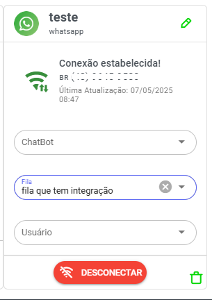

---
title: "Referência da API"
sidebarTitle: "API Reference"
icon: "code"
---




* Faça o [download do arquivo modelo](../api/apiizing.json)

ALGUNS ENDPOINTS NOVOS PODEM NÃO ESTAR NA DOCUMENTAÇÃO SEMPRE BAIXE MODELO POSTMAN

## Índice

1. [Introdução](api.md#introdução)
2. [Autenticação](api.md#autenticação)
3. [Endpoints](api.md#endpoints)
   * [Mensagens](api.md#mensagens)
   * [Contatos](api.md#contatos)
   * [Tickets](api.md#tickets)
   * [Mensagens Interativas](api.md#mensagens-interativas)
   * [Templates](api.md#templates)
   * [Outros Endpoints](api.md#outros-endpoints)
   * [API PLUS (Novos Endpoints)](api.md#api-plus-novos-endpoints)
4. [Exemplos de Código](api.md#exemplos-de-código)

## Introdução

A API do Whazing permite a integração com o WhatsApp Business API para envio e gerenciamento de mensagens, contatos e tickets.

* **Base URL**: `https://testeapi.whazing.com.br/v1/api/external/[SEU-ID]`
* **ExternalKey**: Identificador único para cada mensagem (pode ser qualquer valor e aparece no webhook na apiConfig)

## Autenticação

Todas as requisições devem incluir o token Bearer no header:

```http
Authorization: Bearer seu-token-aqui
```

## Endpoints