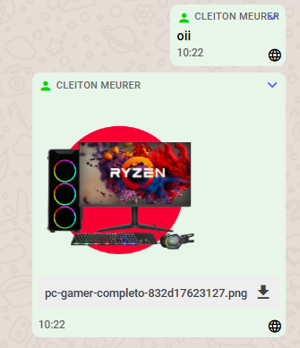
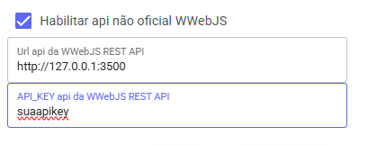
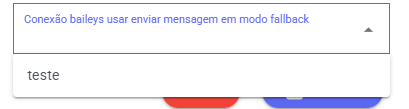

# Modo Fallback

Caso você esteja utilizando a API oficial (com leitura de QR Code e manutenção de sessão via aplicativo), o sistema contará com um **modo fallback**.

Se a mensagem falhar na API oficial, o sistema tentará reenviá-la usando o **wwebjs** ou baileys depende o que estiver configurado.

---

## Como funciona

* O sistema tentará o envio pela **API oficial**.

  Se falhar, o ícone mudará para um "X", indicando a rejeição da mensagem.

* Se o canal estiver configurado com o **wwebjs** ou **Baileys**, o sistema tentará o reenvio por ele.

  Se for bem-sucedido, o ícone será atualizado para um **globo**, indicando que foi enviado via wwebjs ou baileys.



* Caso opção _Ignorar Mensagens Enviadas fora do aplicativo_ estiver desativado vai aparecer mensagem novamente.

---

## Como instalar a wwebjs-api

Execute o comando abaixo para rodar a API em um container Docker:

```bash
docker run -d \
  --name wwebjs_api \
  -p 3500:3000 \
  --restart=always \
  -e ENABLE_LOCAL_CALLBACK_EXAMPLE=FALSE \
  -e MAX_ATTACHMENT_SIZE=10000000 \
  -e SET_MESSAGES_AS_SEEN=FALSE \
  -e "DISABLED_CALLBACKS=auth_failure|authenticated|call|change_state|disconnected|group_join|group_leave|group_update|loading_screen|media_uploaded|message|message_ack|message_create|message_reaction|message_revoke_everyone|qr|ready|contact_changed" \
  -e ENABLE_SWAGGER_ENDPOINT=FALSE \
  -e PUPPETEER_SKIP_CHROMIUM_DOWNLOAD=TRUE \
  -e NODE_ENV=production \
  -e API_KEY=suaapikey \
  -e ENABLE_WEBHOOK=FALSE \
  -e PORT=3000 \
  avoylenko/wwebjs-api
```

* A API ficará acessível na porta **3500** com a chave de acesso `suaapikey`.

  Altere conforme necessário.

### Atualizando a imagem

```bash
# Puxar a versão mais recente
docker pull avoylenko/wwebjs-api

# Remover o container antigo
docker rm -f wwebjs_api

# Recriar com a nova imagem
docker run -d \
  --name wwebjs_api \
  -p 3500:3000 \
  --restart=always \
  -e ENABLE_LOCAL_CALLBACK_EXAMPLE=FALSE \
  -e MAX_ATTACHMENT_SIZE=10000000 \
  -e SET_MESSAGES_AS_SEEN=FALSE \
  -e "DISABLED_CALLBACKS=auth_failure|authenticated|call|change_state|disconnected|group_join|group_leave|group_update|loading_screen|media_uploaded|message|message_ack|message_create|message_reaction|message_revoke_everyone|qr|ready|contact_changed" \
  -e ENABLE_SWAGGER_ENDPOINT=FALSE \
  -e PUPPETEER_SKIP_CHROMIUM_DOWNLOAD=TRUE \
  -e NODE_ENV=production \
  -e API_KEY=suaapikey \
  -e ENABLE_WEBHOOK=FALSE \
  -e PORT=3000 \
  avoylenko/wwebjs-api
```

> ⚠️ Atenção: a wwebjs é uma API que utiliza navegador em segundo plano, então o consumo de recursos da VPS é maior.
> Se necessário, considere rodá-la em uma VPS separada.

---

## Como configurar via WWJS

1. Vá até **Canais** e clique no ícone de edição.



2. Preencha a URL da API do wwebjs.

   Se estiver rodando no mesmo servidor, use `http://127.0.0.1:porta`.
   Se for um servidor externo, use `http://ip:porta` (a porta precisa estar aberta no firewall para acesso).

3. Insira a mesma **API_KEY** configurada na API.
4. Se configurado corretamente, um botão novo aparecerá.

   Dê **F5** na página, se necessário, para atualizar.

5. Clique em **Conectar** para iniciar a conexão.

   Depois disso, aparecerá o botão para exibir o **QR Code**.

Se aparecer a mensagem `"QR Code não está pronto ou já foi escaneado"`, clique em **Atualizar QR** até que o código apareça.

Com o QR na tela, basta escanear com o WhatsApp em "Conectar ao WhatsApp Web".

Após conectar, a página será atualizada e o botão mudará para **Desconectar wwebjs**, indicando que está funcionando corretamente.

## Como configurar via baileys



* Selecione o canal queira mensagem saia, esse canal será usado para enviar mensagem e para chamadas pelo wavoip caso tenha apikey

---

## Aviso ⚠️

**Não utilize essa funcionalidade para envio em massa (spam).**

Seu número pode ser banido permanentemente pelo WhatsApp.

