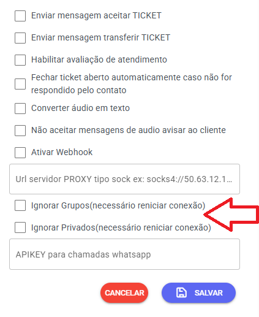

# Grupos x API Oficial WhatsApp

## Importante: Limitações da API Oficial

A API Oficial do WhatsApp funciona **exclusivamente** após autenticação via QR Code, porém possui uma limitação importante: **não suporta interações com grupos**.

---

## Solução: Utilizando Conexão Baileys

Para receber mensagens de grupos no Whazing, siga estas etapas:

1. Configure uma conexão Baileys
2. Nas configurações da conexão Baileys:
   * Desative a opção "Ignorar grupos"
   * Ative a opção "Ignorar Privados"

---

## Recomendação de Uso

Para uma configuração otimizada:

* Use a **API Oficial** para mensagens privadas
* Use a **Conexão Baileys** exclusivamente para grupos

Esta configuração permite que você:

* Receba todas as mensagens de grupos através da conexão Baileys
* Mantenha as mensagens privadas gerenciadas pela API Oficial

