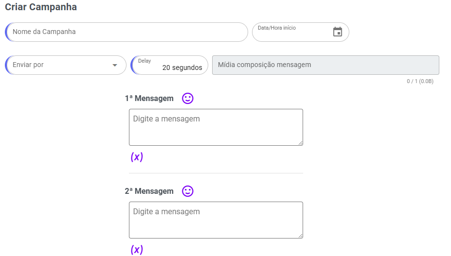
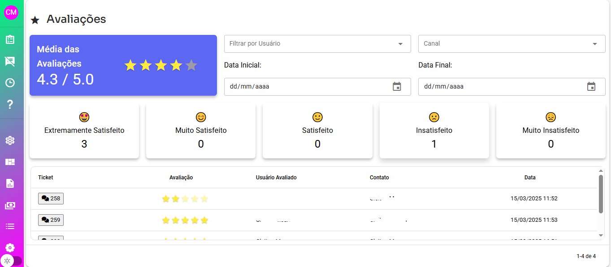

## **Passos para Configuração**

1. Acesse **Canais** na plataforma.
2. Clique no ícone de lápis para **editar** o canal desejado.
3. Localize a opção **Habilitar Avaliação de Atendimento** e ative-a.

## **Campos para Configuração**

Ao habilitar a avaliação de atendimento, você poderá configurar os seguintes campos:

### **1. Mensagem para Solicitar Avaliação**

* Aqui, você define a mensagem que será enviada ao cliente para solicitar uma avaliação do atendimento.
* **Exemplo de mensagem:** "Por favor, avalie nosso atendimento com uma nota de 1 a 5. Sua opinião é muito importante para nós!"

### **2. Mensagem Após o Cliente Avaliar**

* Defina o texto que será enviado após o cliente realizar a avaliação.
* **Exemplo de mensagem:** "Obrigado por compartilhar sua opinião! Estamos sempre buscando melhorar."

### **3. Mensagem para Avaliação Inválida**

* Configure o texto caso o cliente envie uma avaliação fora do formato esperado (por exemplo, uma nota que não esteja entre 1 e 5).
* **Exemplo de mensagem:** "Sua avaliação não foi válida. Por favor, envie uma nota entre 1 e 5."

### **4. Tempo para Avaliação**

* Determine o tempo, em minutos, que o sistema aguardará para receber a avaliação do cliente após o envio da solicitação.
* **Exemplo:** Defina 10 minutos, caso queira que o cliente tenha esse intervalo para responder.

### **5.** Intervalo em horas entre as solicitações de avaliação

* Determine o tempo, em horas, que o sistema aguardará para solicitar uma nova avaliação
* **Exemplo:** Defina 6 horas, somente será solicitado avaliar atendimento após 6 horas da uma avaliação.

Avaliações em canais que suporta plus\_whatsapp e api oficial é possível enviar lista para escolha. Terá novos campos configurar dados da lista.

## **Monitoramento do Desempenho**

* Para acompanhar os resultados, acesse os **Relatórios** na plataforma.
* Os relatórios exibem informações detalhadas sobre o desempenho da equipe, como:
  * Quantidade de avaliações recebidas.
  * Média das notas atribuídas.
  * Percentual de avaliações válidas/inválidas.

***

**Exemplo de Uso:** Após habilitar e configurar o canal, o fluxo no finalizar atendimento será assim:

1. O cliente recebe: "Por favor, avalie nosso atendimento com uma nota de 1 a 5."
2. Envia uma nota. Exemplo: **5.**
3. Caso válido, recebe: "Obrigado por compartilhar sua opinião!"
4. A equipe pode visualizar a avaliação nos relatórios para analisar desempenho.

