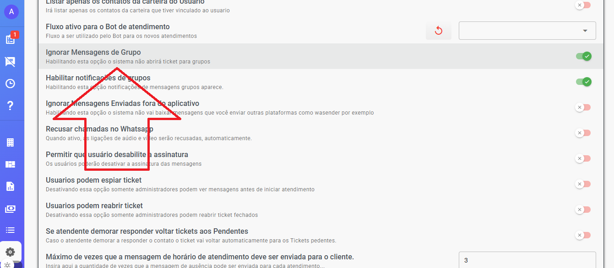

Nas configurações tem nova opção onde você pode configurar, depois configurado ao preencher texto vai aparecer botão acima. Pode ser usado Groq ou Openai.

Sugestão de Prompt Corrija o texto a seguir em português brasileiro, mantendo o conteúdo original. Apenas melhore a ortografia, gramática e fluidez, sem adicionar, remover ou alterar informações. Retorne somente o texto corrigido, pronto para ser enviado ao cliente e inclua ocasionalmente algum emoji.

Após configurado aparece tela atendimento aparece o botão acima, e abaixo resultado após melhoria

Obter key ChatGPT: [https://platform.openai.com/settings/organization/api-keys](https://platform.openai.com/settings/organization/api-keys)