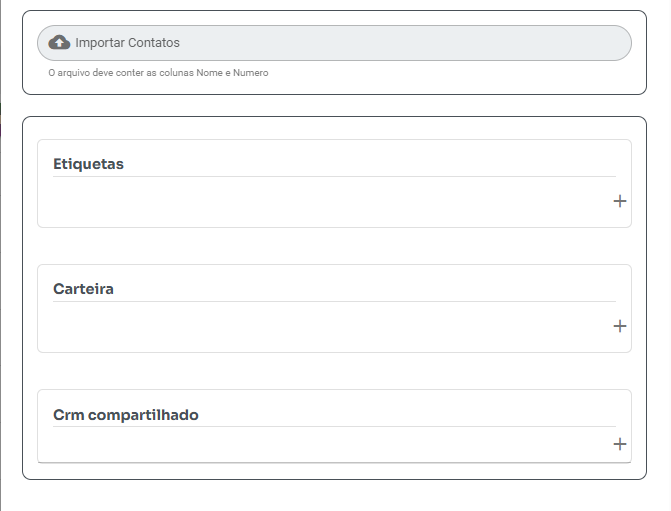

Facilite o cadastro em massa dos seus contatos no WHAZING utilizando um arquivo `.csv` no formato correto e atualizado.

***

## 🛠️ **1. Baixe e Edite o Arquivo Modelo**

* 📥 Faça o [**download do arquivo modelo**](../importarcontatos/modelo.csv)
* 📝 Ao abrir o arquivo em um editor de texto (ex: **Bloco de Notas**, **Notepad++** ou **VS Code**), ele deve seguir o seguinte formato:

```csv
nome;numero;email;empresa;aniversario;cargo;cidade;observacoes
Maria Silva;55999999999;maria@email.com;ACME Ltda;10/10/1990;Gerente;Florianópolis;Cliente importante
```

* 🔢 **Atenção:** o número de telefone deve incluir o código do país (ex: `55` para Brasil).
* 💾 **Certifique-se de:**
  * Utilizar **ponto e vírgula (`;`)** como separador.
  * Salvar o arquivo no formato **CSV**, codificado em **UTF-8**.

> ⚠️ Se usar o Excel, lembre-se de salvar como **CSV delimitado por ponto e vírgula** (`CSV (Separado por ponto e vírgula) (*.csv)`).

***

## 🧾 **2. Estrutura das Colunas Aceitas**

### 🎯 **Colunas Obrigatórias**

| Coluna     | Descrição                                         |
| ---------- | ------------------------------------------------- |
| **nome**   | Nome do contato (obrigatório)                     |
| **numero** | Número do WhatsApp (obrigatório, com DDI, ex: 55) |
| **email**  | E-mail do contato (opcional)                      |

***

### ✨ **Colunas Personalizadas (Exemplos)**

| Coluna                    | Descrição                                                           |
| ------------------------- | ------------------------------------------------------------------- |
| **empresa**               | Nome da empresa                                                     |
| **aniversario**           | Data de aniversário                                                 |
| **cargo**                 | Cargo ou função                                                     |
| **cidade**                | Cidade de residência                                                |
| **observacoes**           | Observações gerais                                                  |
| _(qualquer outra coluna)_ | Será salva automaticamente como **Informação adicional** do contato |

💡 **Dica:** Você pode criar **quantas colunas personalizadas quiser**. Todas as colunas adicionais além de `nome`, `numero` e `email` serão automaticamente registradas como **Informações adicionais do contato**.

***

## 🚀 **3. Importando o Arquivo no WHAZING**

1. No menu lateral, acesse **Contatos** → **Importar**.
2. Clique em **Selecionar Arquivo** e envie o seu arquivo `.csv`.
3. (Opcional) Configure os dados extras:
   * 🧳 **Carteira:** vincule os contatos a uma carteira específica.(será substituidas pela nova caso contato já exista)
   * 🏷️ **Etiquetas:** adicione etiquetas (tags) aos contatos.(será substituidas pela nova caso contato já exista)
   * 📋 **CRM:** adicione os contatos diretamente a um CRM existente (disponível apenas se o CRM for compartilhado)(será substituidas pela nova caso contato já exista).

📸 Exemplo da tela de importação:



***

## 📌 **Observações Importantes**

✅ O sistema valida e **importa apenas números com WhatsApp ativo**. ✅ Arquivos fora do padrão podem causar falhas na importação. ✅ Revise os dados antes de enviar para **evitar troca de dados de contatos**. ✅ Prefira editores que respeitem a formatação CSV com ponto e vírgula.

> 💬 Em caso de dúvidas, consulte nossa documentação oficial ou entre no grupo de suporte: 👉 [https://grupo.whazing.com.br](https://grupo.whazing.com.br)