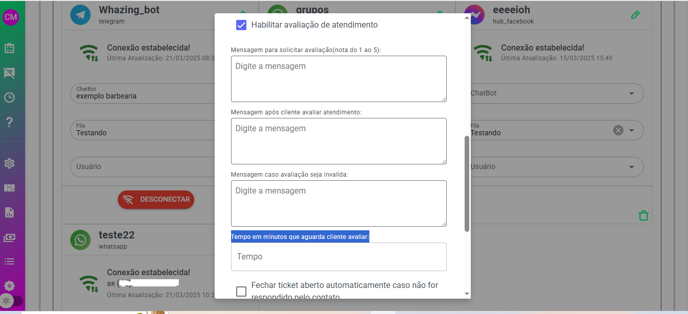

## 1. Verifique o plano do cliente

Certifique-se de que o plano no qual o cliente está cadastrado permite o uso de grupos.

* **Modulo SaaS**: Veja na plataforma a disponibilidade para grupos.\
  

## 2. Desative a opção "Ignorar Mensagens de Grupo"

Garanta que a configuração “Ignorar Mensagens de Grupo” esteja **desativada**.

* **Onde encontrar**: Vá até as **Configurações** gerais.\
  

## 3. Ajuste a configuração do canal

No canal conectado, desative a opção **"Ignorar Grupos (necessário reiniciar conexão)"**.

* **Passo a passo**:
  1. Acesse a lista de canais.
  2. Clique no ícone de lápis para editar.\
     
  3. Após alterar, reinicie a conexão do canal.

***

## Observação Importante

Certifique-se de revisar as três configurações acima, pois, por padrão, grupos vêm **desabilitados**. Essa funcionalidade pode demandar mais recursos, o que pode causar travamentos ou perdas de desempenho no sistema.