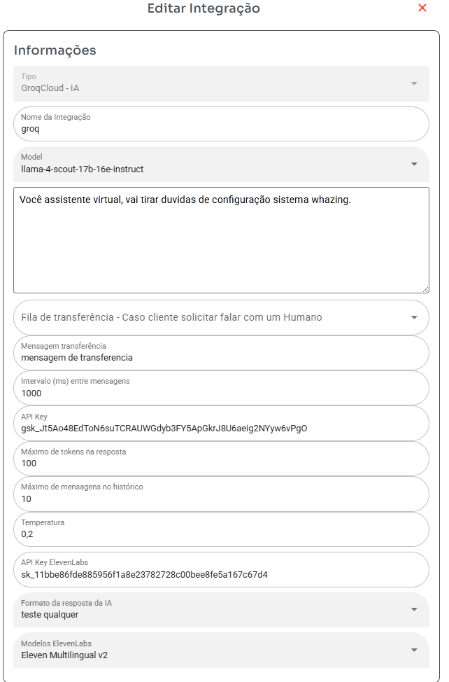

## Passo 1: Configurar a Integração

* **Model**: Selecione o modelo de linguagem (Groq ou ChatGPT).
* **Prompt**: Escreva como a IA deve atender o cliente e agir.
* **Fila**: Escolha a fila para a qual a IA deve transferir se não conseguir responder ou resolver o problema.
* **Mensagem de transferencia**: Mensagem será enviado cliente caso ele pedir falar com um humano
* **Intervalo (ms) entre mensagens**:

Define o tempo de espera (em milissegundos) entre as respostas da IA. Por exemplo: 15000 ms significa 15 segundos.

Durante esse intervalo, se o cliente enviar várias mensagens, a IA responderá apenas uma vez — ou seja, ela aguardará esse tempo antes de responder novamente.

Resumo: a IA só responde uma vez a cada intervalo definido, mesmo que o cliente envie várias mensagens nesse tempo.

* **API Key**: Chave de API para conexão com a IA. Lembre-se de que o ChatGPT cobra por token.
* **Máximo de tokens na resposta**: Define o tamanho máximo da resposta. O ChatGPT cobra por token.
* **Máximo de mensagens no histórico**: Número de mensagens que a IA consultará para montar a resposta. Apenas mensagens do mesmo ticket são consultadas. Um valor muito alto pode fazer a IA travar e aumentar os custos com tokens.
* **Temperatura**: Controla a criatividade da IA. Valores mais altos tornam as respostas menos previsíveis. Pode ser valores como 0,2 ou 1,5.

## Formato da Resposta da IA

* **API Key ElevenLabs**: Necessária se o formato da resposta for diferente de texto.
* **Formato da resposta da IA**: Selecione voz da ElevenLabs deseja usar tem que preencher api key acima antes
* **Modelos ElevenLabs**: Selecione modelo de voz para usar

Obter key ChatGPT: https://platform.openai.com/settings/organization/api-keys