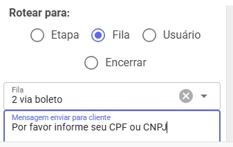

Você deve colocar perguntar cpf ou cnpj do cliente ao encaminhar fila a integração espera receber essa informação

### Passo 1: Configurar Integração 

Atenção:

1. Acesse **Integrações** > clique em **Adicionar** e preencha os dados conforme mostrado na imagem abaixo:
2.

    
3. cadastrar dados para acesso Api Hubsoft

### Passo 2: Configurar Filas 

1. Acesse **Cadastros** > **Filas** > clique em **Adicionar** e preencha os dados conforme mostrado na imagem abaixo:
2.

    
3. Na integração, selecione a opção criada no passo anterior.

### Passo 3: Criar o Chatbot 

1. Crie um chatbot. Verifique a documentação para exemplos de como criar um chatbot.
2. 

### Passo 4: Configurar Condições 

1. Nas **Condições**, configure para rotear para a fila criada anteriormente e adicione uma mensagem solicitando o CPF ou CNPJ do cliente.

Telas do Hubsoft

Criar usuário no icone de mais

Preencher este dados

config da api

Obrigado Adroaldo Ortolan pelo apoio