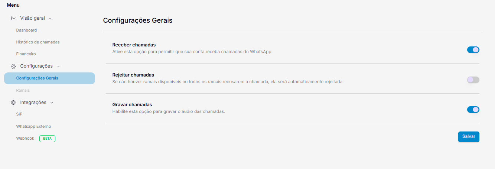
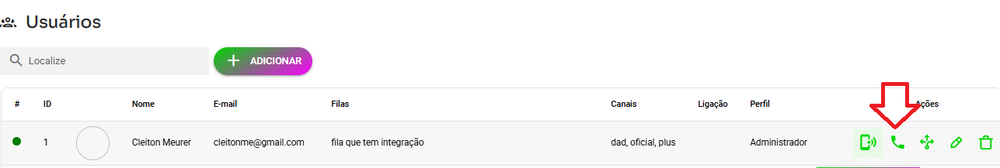

## Passo a Passo

1. **Acesse o site da Wavoip**
   * Visite [app.wavoip.com](https://app.wavoip.com/).
   * Faça o cadastro e realize o login.
2. **Adicione um dispositivo**
   * Após o login, escolha a opção para adicionar um dispositivo, escolha se quer plano gratuito ou pago (com cupom whazing sai R$ 40,00)
3. **Não leia o QRCODE**
   * Não deve ler qrcode conexão será pelo whazing
4. **Copie o Token**
   * Basta copiar.\
     
5. **Acesse a lista de canais**
   * Localize o canal desejado na lista disponível.
6. **Edite as configurações do canal**
   * Cole o token no campo apropriado.
   * Em seguida, clique em "Salvar".\
     
7. **Para realizar uma ligação**
   * Abra um ticket e você verá o botão de telefone na parte superior do ticket. Clique nele para iniciar a ligação.
8. **Receber chamadas e gravação**
   * Garanta que esteja habilitada nas configurações para receber e gravar chamadas



***

## Necessário liberar o canal pro usuario no cadastro usuarios



## Dica Especial

* Aproveite o cupom de desconto **60% desconto** ao utilizar o código abaixo:

```bash
whazing
```